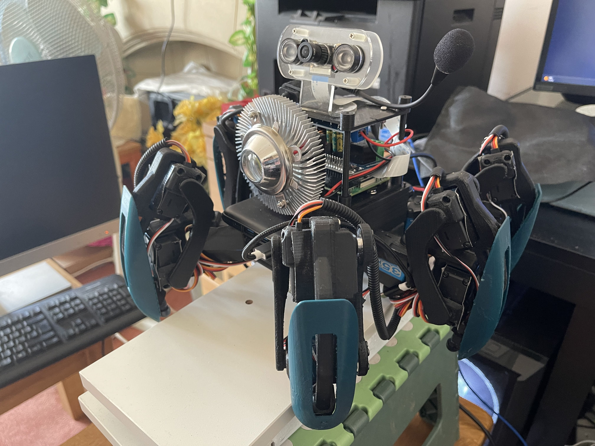

# Luma - Fall Detection Hexapod

Click [here](https://biteable.com/watch/3918198/5554e70b2f63fd9fd3d2394ce02985a4) to watch a video of the Fall Detection Hexapod in action.

This repository contains the development and evaluation of a Fall Detection Hexapod, designed to address fall management in an ageing population. The hexapod is powered by a Raspberry Pi and incorporates various features aimed at providing a proof-of-concept fall management solution.

## Abstract
This project focuses on the construction, implementation, and evaluation of a Fall Detection Hexapod. The primary objective was to develop a robot capable of detecting falls and assisting in fall prevention within social care settings. The hexapod utilizes a Raspberry Pi for processing and control and incorporates features such as a guiding night light, a camera with computer vision algorithms for person tracking, artificial intelligence for fall detection, Wi-Fi connectivity for emergency call functionality, and voice command recognition.

The aim of this project was not only to create a functional fall detection hexapod but also to explore the potential applications and practicality of accessible technologies, such as the Raspberry Pi, in developing customizable care solutions. The study emphasizes the practical implementation and assessment of the hexapod rather than expanding the field of robotics.

Discussions in this project include the performance of the fall detection hexapod, the effectiveness of the guiding night light, and the potential impact on addressing the challenges of falls in an ageing population. Future research directions, including user testing and cost analysis, are also highlighted to enhance the understanding and practicality of this technology.

## Key Features
- Fall detection using artificial intelligence
- Person tracking using computer vision algorithms
- Guiding night light for improved navigation
- Wi-Fi connectivity for emergency call functionality
- Voice command recognition for interaction
- Utilizes Raspberry Pi for processing and control
- Programmed in Python and ROS2 (Robot Operating System)

## Repository Contents
src/: Source code directory containing the Python and ROS2 implementation
docs/: Additional documentation and resources related to the project
images/: Images and visuals used in the README and documentation

## Getting Started
To get started with the Fall Detection Hexapod, follow these steps:
- Clone this repository to your Raspberry Pi.
- Install the necessary dependencies listed in the documentation.
- Navigate to the src/ directory and run the main Python script to start the hexapod.
- Follow the user guide in the documentation for instructions on how to interact with the hexapod and test the fall detection functionality.

## Documentation
For detailed documentation and instructions on the Fall Detection Hexapod, refer to the documentation folder in this repository. It includes information on the hardware setup, software dependencies, usage guide, and additional resources.

## Future Work
Future research and development on the Fall Detection Hexapod may include:
- Conducting user testing to evaluate the effectiveness and usability of the hexapod in real-world scenarios.
- Performing a cost analysis to assess the feasibility of mass production and deployment in social care settings.
- Refining the fall detection algorithms and artificial intelligence models for enhanced accuracy and reliability.
- Exploring additional features and functionalities that can further improve fall prevention and provide personalized care solutions.

## License
This project is licensed under the MIT License.

## Acknowledgments
Special thanks to the support and guidance provided by the project supervisor and the contributors to open-source libraries and technologies utilized in this project.